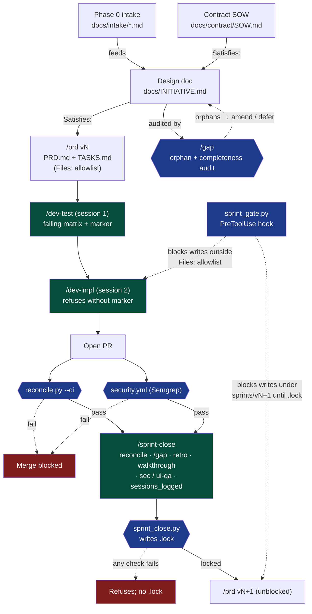

# AI-Assisted Development Method (AADM)

**AADM** is a structured process for shipping enterprise-grade software with Claude Code. Designed for small teams (3–10 engineers) delivering to external clients, with a companion mode for internal product development that may eventually ship as SaaS.

**Current versions:** Method v3.2.1 · Internal Product Mode v1.0 · state-check v0.1

## Core thesis

Automate what you would otherwise ask reviewers to check, and make skipping steps structurally impossible instead of culturally discouraged. Requirements carry stable IDs (§X.Y, Dn, Qn, SOW-§X.Y) that propagate from the contract through the design doc, sprint PRDs, and tasks to code. [`reconcile.py`](tooling/scripts/reconcile.py) enforces traceability in CI.

The method operates at two levels:

- **Initiative level** — a multi-sprint effort to ship a design document. Preceded by **Phase 0** (discovery and design-doc authoring; see the [client intake template](tooling/templates/client-intake-TEMPLATE.md)) when the client hasn't handed you a complete spec. Audited by [`/gap`](tooling/.claude/skills/gap.md) between sprints; `/sprint-close` refuses to lock when orphaned requirements remain.
- **Sprint level** — one sprint of an initiative. Each task runs in two Claude Code sessions (`/dev-test` then `/dev-impl`) with a marker file gating the handoff. Gated by [`/sprint-close`](tooling/.claude/skills/sprint-close.md) before the next sprint can start.

## What this solves

- **PRD → gap analysis → new PRD loops.** Solved by stable requirement IDs plus CI-enforced coverage (`reconcile.py`).
- **Vague client input instead of a spec.** Phase 0 with the intake template (Section 7.5 enumeration discipline) turns vague input into signed-off requirements.
- **Silent requirement drop across multi-sprint initiatives.** A requirement in the design doc that never makes it into any sprint. Solved by `/gap` (script + skill) plus `sprint_close.py` refusal-on-orphans plus a `state-check.py` P1 flag for stale analyses.
- **Sprint-skipping.** Cannot start v(N+1) while v(N) is unlocked. Solved by `/sprint-close` writing the `.lock` and `sprint_gate.py` PreToolUse hook blocking writes.
- **Silent scope expansion.** Implementation phases drifting past declared scope. Solved by `sprint_gate.py` enforcing a `Files:` allowlist parsed from the active TASKS.md.
- **Test-after-the-fact masquerading as TDD.** Single-session "/dev that writes tests then implements" lets the model coerce tests to match code. Solved by splitting into `/dev-test` (writes failing matrix, commits) and `/dev-impl` (separate session; refuses to start until `dev_session.py` verifies the test commit on disk).
- **Silent descoping.** Solved by `[DEFERRED]` discipline (target sprint + reason required).
- **Tests that look thorough but miss real bugs.** Solved by the test matrix (categories D and E specifically) plus periodic mutation testing.
- **Repeating the same class of bug.** Solved by the failures log feeding forward into new design docs and the `/incident` skill naming an enforcement surface for every prevention rule.

## What's in this repo

```
.
├── START-HERE.md             # Reading order and bootstrap steps
├── method/                   # Method document (v3.2.1)
├── handbook/                 # Practical guide for engineers
├── internal-mode/            # Companion mode for internal product work
├── state-check/              # Repo-state detection CLI + Claude Code skill
├── metrics/                  # Gate-event logger (Phase 1) — calibration data for retros
└── tooling/                  # reconcile.py, CI workflows, templates
```

## Quick start

Read [START-HERE.md](START-HERE.md) first. It covers the reading order (60–90 min for tech leads, 45 min for engineers) and the bootstrap steps for a new client repo.

If you want to adopt AADM on an existing project but can't take a full-bundle bootstrap, read [MINIMUM-VIABLE-ADOPTION.md](MINIMUM-VIABLE-ADOPTION.md) instead — four pieces (CLAUDE.md + stable IDs + `Satisfies:` + `reconcile.py` in CI) under a day, compatible with adopting the rest later.

## The enforcement pipeline



**Blue** = structural gate (non-skippable). **Red** = refusal path. **Green** = ceremony. Every box maps to a script or a skill in [tooling/](tooling/). The intake's Section 7.5 completeness pass and the design doc's stable §X.Y / Dn / Qn / SOW-§X.Y IDs are the traceability anchors that flow through `Satisfies:` lines on every downstream task.

**The typical sprint, at the engineer's eye level:**

1. `/prd` reads the design doc, scopes this sprint, writes `PRD.md` + `TASKS.md` (each task carries a `Files:` allowlist).
2. For each task: `/dev-test` writes the failing test matrix, commits, drops a marker. **Open a new Claude Code session.** `/dev-impl` verifies the marker and implements until tests pass.
3. PR opens. `reconcile.py --ci` (traceability) and `security.yml` (Semgrep) gate the merge.
4. End of sprint: `/gap` audits initiative-level coverage. `/sprint-close` runs all the checks and writes `.lock`. The PreToolUse hook now permits writes under `sprints/v(N+1)/`.

## Reading order by role

- **Tech leads and PMs:** [method/](method/) first. Read [internal-mode/](internal-mode/) if you build products internally. Reference [handbook/](handbook/) when onboarding engineers.
- **Engineers:** [handbook/](handbook/) first. Reference [method/](method/) for context and rationale.
- **New engineer onboarding:** [handbook/](handbook/) + your project's `CLAUDE.md` + recent entries in `docs/failures/`.

## Tooling

### Structural enforcement (these block work that would otherwise pass)

| Tool | What it does |
|---|---|
| [`reconcile.py`](tooling/scripts/reconcile.py) | Sprint coverage check. Every PRD requirement must be satisfied by a completed task or `[DEFERRED]` with target. Symbol-presence check catches "empty stub passes reconcile." `--strict-symbols` hard-fails on stubs. Runs in CI via [reconcile.yml](tooling/.github/workflows/reconcile.yml). |
| [`gap.py`](tooling/scripts/gap.py) | Initiative-boundary coverage check. Diffs design-doc stable IDs against the union of `Satisfies:` lines across all sprints. Emits `docs/<INITIATIVE>_GAP_ANALYSIS.md` with covered / deferred / orphaned / conflicted sections. v1 handles single-hop `SUPERSEDED-BY:`. Driven by [/gap](tooling/.claude/skills/gap.md). |
| [`sprint_close.py`](tooling/scripts/sprint_close.py) | Atomic sprint closure. Runs reconcile, refuses on `/gap` orphans, verifies `RETRO.md` is real (not template stub), verifies `SIGNOFF.md`, runs scope-artifact checks (`/security-review` and `/ui-qa` artifacts when the PRD flagged them required), refuses if zero session events were logged when `metrics/` is installed. Writes `sprints/vN/.lock` only when every check passes. Python stdlib only. |
| [`sprint_gate.py`](tooling/hooks/sprint_gate.py) | Claude Code `PreToolUse` hook. Two enforcement modes: (1) blocks writes under `sprints/vK/` when an earlier `sprints/vJ/` (J<K) lacks `.lock`; (2) when a prior sprint is unlocked, blocks writes outside the active TASKS.md `Files:` allowlist (open `[ ]` tasks only — `[x]` and `[DEFERRED]` excluded). Logs blocks to `sprints/vN/.gate-blocks.log`. Install via [claude-settings-hooks-TEMPLATE.json](tooling/templates/claude-settings-hooks-TEMPLATE.json). |
| [`security.yml`](tooling/.github/workflows/security.yml) | Semgrep merge gate. Blocks PRs on any ERROR-severity finding. Deliberate suppressions live in `docs/security/suppressions.md` (template at [security-suppressions-TEMPLATE.md](tooling/templates/security-suppressions-TEMPLATE.md)) with a 90-day re-review ceremony enforced by state-check. |
| [`dev_session.py`](tooling/scripts/dev_session.py) | Marker-file enforcement for the `/dev-test` → `/dev-impl` session split. `test-done` writes `sprints/vN/.in-progress/T-NNN.test-session-done` with the test commit SHA. `check-impl-ready` refuses the implementation session unless the marker exists, is well-formed, and the recorded commit is verifiable on disk. `mark-complete` moves the marker to `T-NNN.complete`. Method rule 4 made structural. |

### Skills (conversational wrappers around the scripts)

| Skill | When to run it |
|---|---|
| [`/prd`](tooling/.claude/skills/prd.md) | Start of sprint. Scopes from the design doc, runs the scoped-completeness pass (step 4), produces `PRD.md` + `TASKS.md` with `Files:` allowlist on each task. |
| [`/dev-test`](tooling/.claude/skills/dev-test.md) | Session 1 of every task. Writes the failing test matrix (categories A–E per `Tests required:`), commits, drops the `dev_session.py` marker. |
| [`/dev-impl`](tooling/.claude/skills/dev-impl.md) | Session 2 of every task — **must be a new Claude Code session**. Refuses to start until `dev_session.py check-impl-ready` succeeds. Implements until the matrix passes. Runs `mark-complete` on done. |
| [`/dev`](tooling/.claude/skills/dev.md) | Router only. Points the engineer at `/dev-test` or `/dev-impl` based on whether a marker exists. |
| [`/gap`](tooling/.claude/skills/gap.md) | Between sprints, before `/sprint-close`. Runs the script, walks the engineer through orphans and conflicts, performs the upstream-completeness pass against intake §7.5, commits the analysis. |
| [`/sprint-close`](tooling/.claude/skills/sprint-close.md) | End of sprint. Wraps `sprint_close.py`. Walks the engineer through `RETRO.md` (template-stub answers rejected structurally), sign-off, and `/security-review` / `/ui-qa` escalation when the PRD said they were required. Refuses lock on any check failure. |
| [`/security-review`](tooling/.claude/skills/security-review.md) | When the sprint PRD declares `` `/security-review` required: Yes ``. Produces `sprints/vN/SECURITY-REVIEW.md`; `Decision: blocked` blocks the lock. |
| [`/ui-qa`](tooling/.claude/skills/ui-qa.md) | When the sprint PRD declares `` `/ui-qa` required: Yes ``. Produces `sprints/vN/UI-QA.md`; `Decision: blocked` blocks the lock. |
| [`/incident`](tooling/.claude/skills/incident.md) | Post-deployment learning loop. Orchestrates the post-mortem, extracts a prevention rule into `docs/failures/`, names the enforcement surface (CLAUDE.md / CI / architecture guard / security prompt / test matrix). Open incidents flagged P1 by state-check. |
| [`/gate-1-to-2`](tooling/.claude/skills/gate-1-to-2.md), [`/gate-2-to-3`](tooling/.claude/skills/gate-2-to-3.md) | Internal Product Mode graduation gates. Stage 2→3 enforces the pre-committed retention metric (must be in the Stage 2 PRD *before* the data is read). |

### Heads-up display

| Tool | What it does |
|---|---|
| [`state-check.py`](state-check/scripts/state-check.py) | Detects mode, stage, active sprint, and flags. Surfaces P0 (blocking) / P1 (warn) / P2 (nudge). Includes `check_gap_analysis_staleness` (P1 when `docs/<INITIATIVE>_GAP_ANALYSIS.md` is missing or older than the newest sprint `.lock`). Ships with a conversational [skill](state-check/.claude/skills/state-check.md). |
| [`metrics.py`](metrics/scripts/metrics.py) | Append-only JSONL event log at `docs/metrics/events.jsonl`. Gate events (Phase 1, automatic from CI) and session events (Phase 2, manual `log-session`). `sprint_close.py` refuses zero-session sprints when `metrics/` is installed. Threshold interpretation deliberately deferred — see [METRICS.md](metrics/docs/METRICS.md). |

### Process artifacts

- [AI-assisted PR review checklist](tooling/templates/code-review-AI-CHECKLIST.md) — ~25-item checklist for PRs marked `AI-assisted: yes` in [.github/pull_request_template.md](.github/pull_request_template.md). Targets AI-specific failure modes (invented APIs, plausible-but-wrong docstrings, defensive coding for impossible states, silent scope creep, tests modified to match implementation).
- Templates under [tooling/templates/](tooling/templates/) — CLAUDE.md, client intake (Section 7.5 = enumeration discipline), sprint PRD, sprint TASKS (`Files:` is load-bearing — see template), retro, failures log, security suppressions, incident post-mortem, security review, UI QA.

## What this deliberately does NOT include yet

- **Mutation testing setup** — language-specific; add when you pick critical modules.
- **Threshold interpretation for session metrics** (follow-up to [#13](https://github.com/colaberry/AADM-Ai-Assisted-Development-Method/issues/13)) — the structural pieces shipped (`log-session`, `sprint_close.py` zero-sessions refusal, retro template section). Threshold ranges (healthy / high / low session counts, rework-rate alerts) and the rollup CLI are deliberately deferred until at least one engagement has run 3+ sprints under both gate and session logging. Calibrating against simulated data misleads more than it informs.
- **Multi-hop `SUPERSEDED-BY:` chain semantics for `/gap`** ([#29](https://github.com/colaberry/AADM-Ai-Assisted-Development-Method/issues/29)) — v1 handles single-hop supersession; full chain resolution is a separate piece.

(Earlier "not yet" items — `/gap` automation, `/security-review` and `/ui-qa` skills, `sprint-close` automation, the cross-sprint hook, the test/impl session split — have all shipped. See [CHANGELOG.md](CHANGELOG.md).)

## Status

This is a **production v1**, not a finished product. Ready to adopt on a real engagement, but expect to modify scripts and templates within the first month of real use. Real data beats hypotheticals — the best feedback starts with "we tried X and Y happened." See [CHANGELOG.md](CHANGELOG.md) for version history and roadmap.

## Calibration for small teams

- **Mutation testing:** monthly, critical modules only. Not weekly.
- **`/gap`:** per initiative and quarterly for long-running engagements. Not monthly.
- **Per-client repos:** one per engagement.
- **CLAUDE.md:** under ~500 lines.
- **Active failures-log rules:** 20–50 for a mature codebase. Prune quarterly.
- **Phase 0 duration:** 1–3 weeks for typical enterprise engagements.

## Local conventions for private notes

For maintainers who want to keep client-specific notes, engagement writeups, or internal discussion of how this methodology is being applied to a real client *alongside* the public repo (without those notes leaking publicly), the following folder/file patterns are gitignored and safe for private content:

- `clients/` — anything under here, e.g. `clients/acme-corp/notes.md`
- `private/` — generic catchall
- `*.private.md` — any markdown file ending in `.private.md`
- `*.private/` — any folder ending in `.private`

These patterns are enforced by [`.gitignore`](.gitignore). Verify with `git status` before committing if you're not sure — Git will silently ignore matching paths and they will never be staged.

## Contributing

Feedback, bug reports, and method refinements are welcome. Issue templates cover three kinds of input:

- **Tooling bugs** — for problems in `reconcile.py`, `state-check.py`, or the CI workflow.
- **Method feedback** — for content-level refinements to the method, handbook, or internal mode.
- **New skill proposals** — for skills that should be promoted from manual checklist to tooling.

See [CONTRIBUTING.md](CONTRIBUTING.md) for details.

## License

Apache-2.0. See [LICENSE](LICENSE).
