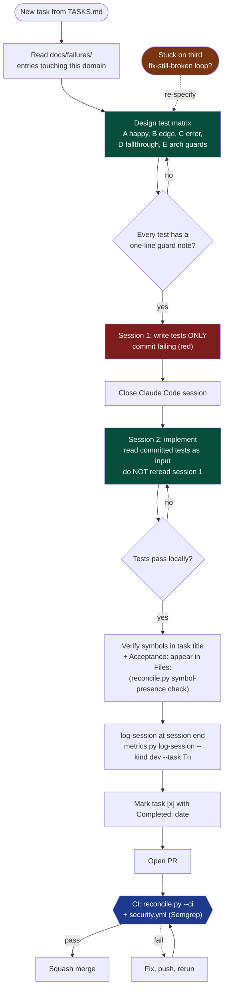

# Developer Handbook

*Practices for engineers working on teams that use the AI-Assisted Development Method (AADM)*

This document is for engineers on the ground. It assumes you have read (or will read) the main method document. This handbook covers three things:

1. **Daily practices** — how to actually write a good `Satisfies:` line, a useful test, a real retro entry.
2. **Prompting Claude Code within the method** — how to keep context clean, what to say at task kickoff, how to recognize drift.
3. **Speed without cutting corners** — legitimate shortcuts and traps to avoid.

It is deliberately concise. If you're looking for the philosophy, read the main method. If you're looking for what to do on Monday morning, read this.

---

## The per-task loop at a glance



Red boxes are where tests live failing on disk. Green boxes are forward progress. Blue is CI enforcement. Orange is the re-specify escape hatch — if you're in a loop, the problem is underspecification, not a missing tweak.

---

## Part 1: Daily practices

### 1.1 Writing a good `Satisfies:` line

The `Satisfies:` line on a task is how requirement traceability works end to end. It's read by humans during review and by `/reconcile` in CI. A bad `Satisfies:` line is the single most common way teams lose traceability.

**Good:**
```
- [ ] T014: Implement SAML response validation
  - Satisfies: SOW-§4.2, D7, Q3
```

**Bad:**
```
- [ ] T014: Implement SAML response validation
  - Satisfies: auth requirements   ← not IDs; can't be parsed or reconciled
```

**Also bad:**
```
- [ ] T014: Implement SAML response validation
  - Satisfies: SOW-§4, D5-D9        ← ranges; /reconcile won't match these
```

**Rules of thumb:**

- List specific IDs, comma-separated, no ranges.
- Include every ID the task genuinely closes — not just the "main" one.
- If a task claims to satisfy an ID but doesn't actually produce code that addresses it, that's a `/reconcile` failure waiting to happen. Split the task.
- If you find yourself wanting to cite a requirement that doesn't have an ID yet, stop and assign one. Don't invent `Satisfies:` against ungraspable prose.

**Symbol-presence check.** `/reconcile` doesn't only confirm that the paths under `Files:` exist — it also extracts candidate symbols from your task's title and `Acceptance:` line and greps the listed files for them. Backticked tokens (e.g. `` `_routes_differ` ``) are the strongest signal; bare `snake_case`, `camelCase`, `PascalCase`, and `ALL_CAPS` identifiers are picked up too. If the file exists but contains none of those symbols, you get a `STUB-WARNING:` and the entry is demoted to MEDIUM confidence — the "empty stub passes reconcile" pattern. Two implications: (1) write task titles and `Acceptance:` lines that name the actual symbol you're going to add or modify (`Wire \`_routes_differ\` into the load_ref path`, not `Improve threading`); (2) `/reconcile --strict-symbols` is the strict mode that fails CI on stubs — opt in for a sprint after you've sanity-checked your team's symbol naming.

### 1.2 Designing the test matrix (Step 2.5)

Before writing any test code, you write down the plan. Five categories. You do this every task. It takes 10–20 minutes. It is the step that teams skip and the step that catches the bugs they then ship.

| Category | What to include | Common mistakes |
|---|---|---|
| **A — Happy path** | The minimum test that proves the feature works end-to-end when used correctly. | Writing five "happy path" tests that are all the same scenario with slightly different inputs. One is enough. |
| **B — Edge cases** | Empty input, null, boundary values (0, 1, max), single vs many, missing optional fields. | Missing the "empty collection" case. It's the most common integer-overflow equivalent for modern code. |
| **C — Error paths** | Preconditions fail. Dependencies error. Malformed input. Auth missing. | Testing that *an* error is returned, not that the *right* error is returned. Exact error shape matters. |
| **D — Fallthrough / integration** | When new code's precondition fails, how does pre-existing code behave? Cross-products of (new feature × old edge case) and (no new feature × new edge case). | Skipping this because "the existing code works fine." The bug is never in the feature; it's in the interaction. |
| **E — Architecture guards** | `inspect.getsource()` or equivalent: deleted symbols stay deleted, new symbols exist, required call patterns present. | Writing E tests as "make sure the function exists." Better: "make sure `validate_session()` is called before any route handler, and that no handler exists without it." |

**For each test, write a one-line note about what it's guarding against.** If you can't write the note, the test isn't pulling its weight.

**Category D is where teams leak bugs.** Example: you add a new feature flag that changes how authorization works. Test D isn't "does the flag work?" — it's "when the flag is off, does the old authorization path still work unchanged?" and "when the flag is on, does the old authorization path that this replaces stop being reachable?" Both of those will surprise you.

**Category E is where teams leak architectural decay.** Example: you delete a deprecated function. Three months later someone re-adds it because they didn't know it was deprecated. An E test that asserts `assert 'old_function' not in inspect.getsource(auth_module)` prevents this.

### 1.3 Separate sessions for tests and implementation

This is the single most important practical rule in the method. It's also the one most engineers initially dismiss as ceremony.

**The mechanic:** Start a fresh Claude Code session for writing tests. Close it. Start a new one for implementation. The new session reads the committed failing tests as input but has no context on what the intended implementation looks like.

**Why it matters:** When Claude Code can see the implementation being planned, it writes tests that match the implementation. That's not test-first development; that's elaborate test-after dressed up as TDD. You get tests that pass when the code ships and that still pass when the code is broken, because they were written to describe the code, not the behavior.

**What good practice looks like:**

```
Session 1 (tests only):
  "I'm writing tests for task T014. Here's the task spec and the test
  matrix plan. Write failing tests for categories A, B, C, D, E. Do not
  write implementation. Do not describe what the implementation should
  look like. Only write tests."

[Commit failing tests. Close session.]

Session 2 (implementation):
  "Here are failing tests for task T014. Implement the minimum code to
  make them pass. Run the tests after each change. If a test seems wrong,
  flag it — do not modify."
```

**What bad practice looks like:**

```
One session:
  "Let's implement task T014. First write tests, then write the code."

[Claude writes a plan for the implementation, then writes tests that
match the plan, then writes the implementation that matches the tests.]
```

Both sessions produce code that passes tests. Only one of them produces code that proves the feature works.

### 1.4 Writing a useful failures-log entry

Each entry ends with a prevention rule. If you can't write the prevention rule, the entry isn't done. If you can't write a prevention rule that's more specific than "be more careful," the entry isn't useful.

**Good prevention rule:**
> Expiry tests must advance real or fake-but-advancing time past the expiry threshold between token generation and token validation. Apply to session expiry, OTP, signed URLs, and rate-limit windows. Added to CLAUDE.md under "test patterns".

**Bad prevention rules:**
> Be more careful with expiring tokens.
> Review expiry logic more thoroughly.
> Add more tests for time-based logic.

The good rule is specific enough that you could implement it as a linter check or a test fixture. The bad rules are aspirational.

**Where every prevention rule has to live.** Check at least one box. An entry without a "lives in" placement is a wish, not a rule.

- [ ] Added to CLAUDE.md under "Never-do rules"
- [ ] Added to `/dev` Step 2.5 test-matrix guidance for category X
- [ ] Added as a CI check
- [ ] Implemented as an architecture-guard test (Category E)
- [ ] Added to `/security-review` or ambiguity-pass prompt

### 1.5 Running a useful retro

A retro that produces zero entries in the failures log or zero updates to CLAUDE.md is a retro that didn't do its job — unless the sprint genuinely surfaced nothing worth capturing (which is normal for routine sprints).

**Target outcomes from a retro:**
- Zero to three new failures-log draft entries
- Zero to two CLAUDE.md updates
- Zero to five actions assigned with owners and dates

**If you're consistently producing zero of everything:** the retros are performative or the sprints are too routine. Either way, something's off.

**If you're consistently producing eight of everything:** the team is noticing problems but not preventing them — the rules aren't actually affecting behavior. Consolidate before adding more.

**Retro hygiene:**

- Run the retro within 24 hours of `/sprint-close`. Fresh context beats thorough context.
- Keep it 30 minutes max. If it's running longer, you're either socializing (fine, but not a retro) or accumulating backlog (bad).
- The facilitator reads the prior retro first. Patterns across retros are more valuable than any single retro.
- Actions have owners and dates. An unassigned action is a suggestion.

### 1.6 Recognizing when to stop and re-specify

You are in the wrong place if any of these are true:

- You've asked Claude Code to "fix this" three times and each attempt introduces new issues.
- The spec for the task says something like "handle user preferences appropriately."
- You keep discovering new requirements that weren't in the PRD.
- You've modified tests twice to make them match what the code is actually doing.

These are not implementation problems. They are specification problems, and they won't be fixed by more `/dev` rounds. Stop, go back to `sprints/vN/PRD.md` or `docs/<INITIATIVE>.md`, and re-read the relevant section. If the spec is genuinely ambiguous, run a focused ambiguity pass and produce questions for a human — do not invent answers.

The rule: **third round of "fix this, still broken" means the spec is the problem, not the code.**

### 1.7 Reading CLAUDE.md

Read it on your first day. Read it when you join a new client repo. Read it before any task in a domain you haven't worked in yet. It's the index to everything else.

If CLAUDE.md is over 500 lines or clearly stale, that's a problem to raise — don't just work around it. Stale context is worse than no context because it misleads confidently.

### 1.8 Reviewing AI-assisted PRs

AI-generated code has a distinct smell. It looks correct — often more polished than hand-written code — but it fails in specific, repeatable ways that generic PR review doesn't catch: invented APIs that don't exist in the pinned version, over-defensive guards against impossible states, plausible-but-wrong docstrings, silent scope creep beyond the task's `Satisfies:` IDs, and tests that were adjusted to match the implementation instead of describing the behavior.

Generic review training tells you to look for "bugs" and "readability." Neither framework surfaces these patterns. The review needs to be AI-aware.

**The rule:** on any PR marked `AI-assisted: yes`, complete the [AI-assisted PR review checklist](../tooling/templates/code-review-AI-CHECKLIST.md) before approving. Copy the checklist into the PR description or reference it with `✅ AI-assist review: checklist-v1 completed by @<reviewer>`.

**What the checklist adds over generic review:**

- Scope verification against `Satisfies:` IDs — catches when the agent "cleaned up adjacent code" without being asked.
- API existence checks — catches hallucinated method signatures, config keys, CLI flags, env variables. Grep vendor docs; don't trust the snippet.
- Plausible-but-wrong docstring detection — read the docstring and function body independently; if the docstring could describe any function in this codebase, it's hallucinated.
- Defensive-coding detection — flags `null` checks on parameters that can't be null, `except: pass` blocks, swallowed promise rejections.
- Test-modification scrutiny — if a test changed in the diff, the commit message must explain *why the old assertion was wrong*. "Adjusted test to match new behavior" is a red flag, not an explanation.

Items marked `[blocking]` in the checklist are merge-blockers; don't approve with caveats. Walk the list top to bottom — the whole point is to force the pause.

**When to skip the checklist.** When the diff was genuinely written by a human and the agent was only used for tab-completion or formatting, `AI-assisted: no` is honest. Don't checkbox-ritualize the process; either the checklist earns its time or it doesn't.

### 1.9 Security as a merge gate

AADM has two structural merge gates. The first is **traceability** (`reconcile.py` / `reconcile.yml`), which blocks PRs that don't cover their sprint's requirement IDs. The second is **security** (`security.yml`), which runs Semgrep on every PR and fails the build on any ERROR-severity finding.

Both gates exist for the same reason: AI-generated code is plausible enough to pass human review. The traceability gate catches "the PR claims to satisfy SOW-§4.2 but nothing in the diff addresses it." The security gate catches "the PR introduces SQL concatenation, a hardcoded secret, an unsanitized template render, or a dangerous subprocess call."

**What to do when the security gate fires on your PR:**

1. **Read the Semgrep finding.** It names the rule, the file, the line, and usually a short explanation.
2. **Fix, don't suppress.** The default response is always to change the code. Parameterize the query, move the secret to an env variable, sanitize the input.
3. **If suppression is genuinely correct** — the rule doesn't apply to this specific call site because of an invariant the scanner can't see — then:
   - Add `# nosemgrep: <rule-id>` (Python) or the equivalent for your language, on the line the rule fires on.
   - Add a matching entry in `docs/security/suppressions.md` using the template from `tooling/templates/security-suppressions-TEMPLATE.md`. Every entry needs a **Re-reviewed** date, a reviewer handle, the **Satisfies affected** IDs, and a concrete **Justification** that names the invariant. "Trusted input" is not a justification; "Input comes from `middleware/auth.py:42` after session validation" is.
4. **Do not disable the workflow.** A disabled gate that you forgot to re-enable is how these things fail silently. If the entire rule pack is noisy, tune `--config=` to a narrower set; don't turn the gate off.

**The 90-day ceremony.** Every entry in `suppressions.md` is re-reviewed every 90 days. `state-check.py` flags entries older than that as P2. Re-review means one of three outcomes: remove the suppression (the rule now applies), update the Re-reviewed date with current reasoning (it still applies), or supersede with a fix. This prevents silent rot.

The manual `/security-review` checklist remains — as the *escalation path*, not the only layer. Use it when the Semgrep finding is ambiguous, when you're touching authentication/authorization/cryptography, or when the suppression would affect a SOW-level security requirement.

### 1.10 Tuning autonomy with `Autonomy:` annotations

Not every task carries the same risk. A doc fix is not a payment-path migration. The `Autonomy:` annotation on a task lets you tell `/dev` how much human checkpointing to do mid-task — instead of using one cadence for everything.

Three valid levels:

- **`direct`** — Claude proceeds end-to-end; the reviewer sees the diff at the end. Use for low-risk, well-tested, easily reversible work: refactors with strong existing test coverage, doc updates, isolated utility additions, mechanical renames.
- **`checkpoint`** — Claude pauses at intermediate milestones for confirmation. **The default.** Use for ordinary feature work — new endpoints, schema additions, business-logic changes that have tests and aren't security-sensitive.
- **`review-only`** — every step requires explicit human go-ahead before continuing. Use for high-risk changes: security boundaries, payment paths, schema migrations, anything touching production data, anything where rollback is hard.

The annotation sits in the task block alongside `Satisfies:`, `Files:`, etc.:

```markdown
- [ ] T012: Migrate `users.email` to encrypted-at-rest column
  - Satisfies: §6.4, SOW-§9.1
  - Files: db/migrations/0042_encrypt_user_email.sql, src/users/storage.py
  - Tests required: A, B, C, D, E
  - Autonomy: review-only
```

**How to pick the level.** Tie it to actual risk and test coverage, not to how much you trust the engineer or the model:

- Strong Category D (fallthrough) coverage on production-touching code? Can drop from `review-only` to `checkpoint`.
- No tests at all on a critical path? Should be `review-only` even if the diff is small.
- Mechanical change with E (architecture-guard) tests in place? `direct` is fine.

If you're unsure, default to `checkpoint`. Going one level more cautious costs minutes; going one level less cautious can ship a regression.

**What the tooling does with it.** `reconcile.py` parses `Autonomy:` and surfaces invalid values to stderr (`yolo` is not a level). It does not currently fail on autonomy alone — the annotation is advisory. Once the `/dev` skill ships, it reads this field to decide checkpointing cadence. Even before then, the annotation serves as documentation for human reviewers: a PR landing a `review-only` task with no checkpoint comments in the conversation history is a smell worth surfacing in code review.

**What the annotation does not replace.** It does not replace test coverage, the security gate, or the test matrix. `Autonomy: direct` does not mean "skip Category D"; it means "given that the test matrix is satisfied, proceed without mid-task pauses." If you're tempted to use `direct` to cut testing, the testing is the problem to solve, not the cadence.

### 1.11 Closing the loop after a production incident: `/incident`

AADM's gates stop at `/sprint-close`. Everything between "code merged" and "customer-visible outage" is outside the method's pre-merge scope by design — that's what production monitoring, alerting, and on-call processes are for. But once an incident is over, **what you learn from it has to feed back into the pre-merge surfaces or the same class of bug will recur.** That's what `/incident` is for.

The symptom that `/incident` fixes: every team that has been shipping for a while has a "this is the third time we've hit this" moment — a regression whose root cause was identified months ago, discussed in Slack, maybe even written up in a doc, but never promoted to a *check that runs on every PR*. The failures log, CLAUDE.md, and the test matrix are where prevention actually lives; the post-mortem is just where the decision is made to put it there.

**When to invoke `/incident`:**

- Immediately after an incident is mitigated — not during.
- When a client reports a material defect that made it through sprint-close.
- When discovering a latent bug (shipped but hadn't yet manifested visibly).

**What `/incident` does, in order:**

1. Confirms the incident is actually over. Running a post-mortem during an active page produces bad post-mortems.
2. Creates `docs/incidents/<YYYY-MM-DD>-<slug>.md` from `tooling/templates/incident-TEMPLATE.md`.
3. Walks you through the template section by section, pushing back on vague answers: "around 3pm" → what time exactly; "some users" → how many; "communication was bad" → what specifically.
4. Asks explicitly whether the incident invalidated a requirement or ADR. If yes: a separate design-doc update PR or a superseding ADR is drafted. Silent edits to the spec destroy traceability.
5. Extracts a specific, actionable **prevention rule**. "Write better tests" is rejected. "Token-expiry tests must advance real or fake-but-advancing time past the expiry threshold between generation and validation" is accepted.
6. Creates the corresponding `docs/failures/` entry and cross-links it to the incident.
7. Names the **enforcement surface** where the rule will actually run: CLAUDE.md never-do rule, CI check, architecture-guard test (Category E), `/security-review` prompt lens, or test-matrix discipline. A rule that lives only in the failures log will not catch the next occurrence.

**What `/incident` does not do.** It does not decide severity, page people, assign blame, or close the incident. `Resolved:` goes in when a human confirms the fix is live and stable. The `Post-mortem review` section is filled in after the review meeting (within 5 business days). Until both are filled, `state-check.py` flags the incident as a P1 learning-loop issue.

**The three-strike rule.** If this is the third time you've hit the same class of bug, the existing prevention rules aren't working. Flag that prominently in the post-mortem's "Related entries" section and be explicit about why the prior rule failed — was it not on an enforcement surface, was the surface disabled, or was the rule too narrow to catch this variant? The fix there is process, not another failures-log entry.

**`/incident` does not replace on-call.** On-call is about mitigation, communication, and stakeholder updates during the event. `/incident` is about learning after. Different tools for different moments.

---

## Part 2: Prompting Claude Code within the method

This section is about how to talk to Claude Code specifically in the context of this method. Generic prompting advice applies too, but these practices are specific to what the method expects.

### 2.1 The task kickoff prompt

Start every `/dev` session with the same structure:

```
I'm working on task TNNN in sprints/vN/TASKS.md. Before writing any code:

1. Read sprints/vN/PRD.md and the task entry for TNNN.
2. Read CLAUDE.md.
3. Check docs/failures/ for entries relevant to this task's domain.
4. Announce which design-doc IDs this task satisfies (from Satisfies:).
5. State the key constraints from the PRD, CLAUDE.md, and failures log.
6. If the task is underspecified, stop and list questions. Do not
   proceed with assumptions.

Only after this context is established, propose the test matrix for
Step 2.5.
```

This takes Claude Code 2–3 minutes to execute and catches 80% of the "Claude Code built the wrong thing" failures before they happen. It's the single highest-leverage prompting practice in the method.

### 2.2 Keeping context clean between sessions

**Each `/dev` session = one task.** Don't batch. Batching is the single fastest way to get Claude Code to shortcut later tasks in favor of earlier ones — the later tasks get shallower work as context fills up.

**Each test-writing session = no implementation context.** Per 1.3, this is non-negotiable.

**Each `/gap` agent = one of the three orthogonal views.** Don't merge decisions + subsections + deletions into one prompt. They catch different classes of issues precisely because they're separate contexts.

**Every session starts fresh.** If you open a session that was used for something unrelated, close it. Residual context from the previous task drifts into the new one in subtle ways.

### 2.3 Anti-hallucination patterns

Append these modifiers to any prompt where correctness matters more than speed:

```
If any requirement is unspecified, stop and ask — do not assume.
Prefer failing loudly over guessing.
Before starting, list any ambiguities you see.
Do not invent API fields, library functions, or file paths you have
not verified against the actual codebase.
```

The last line prevents the specific failure where Claude Code references functions that don't exist, file paths that don't resolve, or API fields that sound plausible but aren't there. This is a recurring LLM failure mode and it's cheap to mitigate.

### 2.4 Recognizing drift during a session

Signs that Claude Code has drifted:

- It's proposing a much larger change than the task asks for.
- It's introducing abstractions (a new base class, a generic factory, a trait) that weren't in the task.
- It's modifying tests rather than code to make things pass.
- It's adding error handling for situations the spec doesn't mention.
- It's claiming to have done something but the file on disk doesn't show it.

**Response:** stop the session. Do not keep prompting "no, don't do that." Close it, start fresh with the task kickoff prompt, and explicitly name the constraint it just violated: "For this task, do not introduce new abstractions. Implement only what the failing tests require."

### 2.5 When Claude Code disagrees with a test

This happens: Claude Code reads the failing test, says the test is wrong, and proposes either changing the test or implementing something different. Two rules:

- **Do not let Claude Code modify the test.** The test was reviewed by a human before being committed.
- **Take the disagreement seriously.** Sometimes Claude Code is right — the test was written against a flawed assumption. The right response is to pause the implementation session, re-review the test with a human, and either correct the test (with a note in the commit) or confirm it's correct and push back on Claude Code.

The point: Claude Code's disagreement is useful signal, not authority. Humans decide; Claude Code flags.

### 2.6 Prompting for the test matrix

A weak prompt: "write tests for this task."

A stronger prompt:

```
For task TNNN, design the test matrix before writing any tests.

For each category (A, B, C, D, E), list:
- What test(s) you'll write
- What specifically each one guards against
- What a wrong implementation would look like that this test would catch

If you can't answer the third question for a test, that test is
not valuable. Drop it or rethink it.

Only after we've agreed on the matrix do you write the actual test code.
```

The "what would a wrong implementation look like" question is the single most valuable prompt in the method. It forces the test to commit to a specific failure mode, not just a vague "something should happen."

### 2.7 Prompting for ambiguity passes

The ambiguity pass is deceptively simple: ask Claude Code to list questions. But the quality depends heavily on framing.

**Weak:** "Are there any ambiguities in this spec?"

This produces 2–3 polite, generic questions.

**Strong:**

```
This is a spec. Assume you are about to implement it. For every
decision you would have to make that the spec does not explicitly
dictate, list it as a question. Include:

- Unstated assumptions about inputs and outputs
- Edge cases not addressed
- Error handling not specified
- Interactions with systems or modules the spec mentions but doesn't
  fully describe
- Terms that have multiple plausible interpretations

Output only questions. Do not propose answers. Do not write code.

Target: 15-40 questions for a typical design doc. Fewer than 10 means
you're being too polite.
```

Setting the target count explicitly changes the output character. LLMs calibrate to stated expectations.

---

## Part 3: Speed without cutting corners

The method front-loads specification work that used to be deferred. What feels like overhead is often just the cost of building things correctly made visible. That said, there are legitimate speedups and there are false ones.

### 3.1 Legitimate speedups

**Templated Phase 0 for recurring engagement types.** If your team does the same kind of work across clients (SAML integrations, audit logging, data migrations), build a per-domain intake template that pre-asks the domain-specific questions. Your first engagement in a domain is full-cost; subsequent ones should start from a 60–80% pre-filled template.

**Parallel discovery interviews.** Phase 0 is usually serialized by calendar. Run two or three discovery calls on the same day. Fill the intake during the call, not after. Collapses a week of scheduling into hours.

**Parallel tasks within a sprint.** The "one task per session" rule is about context, not about serializing the team. Three engineers running three `/dev` sessions on three different tasks simultaneously is fine. `/reconcile` in CI keeps them consistent.

**Parallel Claude Code sessions for independent design-doc sections.** When drafting a design doc for a complex initiative, don't serialize it. Three sessions on auth, data flows, and UI simultaneously; merge outputs. This is the same pattern `/gap` uses, applied earlier.

**Shorter sprints.** A 3-day sprint has the same `/sprint-close` overhead in absolute minutes as a 2-week sprint, but the feedback loops are tighter and rework costs less. Shorter sprints often move faster per unit of shipped work.

**Pre-commit `/reconcile` hook.** Run `/reconcile` locally before pushing. Catches gaps in 30 seconds instead of a 10-minute CI round-trip.

**Test fixture library for recurring patterns.** Time-based expiry tests, trust-boundary authorization tests, idempotency tests for webhooks — these patterns repeat across features. Build them once as helper functions; reuse them by name.

**Shared base CLAUDE.md across stack-compatible clients.** If three clients all use React/Node/Postgres, 70% of CLAUDE.md is the same. Keep a base in an internal shared repo; client CLAUDE.md files add only the client-specific 30%.

**Cache the failures-log cross-check.** A simple script that reads `docs/failures/` and emits a condensed "rules relevant to domain X" summary eliminates manual grepping. Re-run only when the failures log changes.

### 3.2 Speedups that look legitimate but aren't

**"Skip the ambiguity pass when the spec is clear."** The ambiguity pass is cheapest exactly when the spec seems clear — 10 minutes, catches 1–2 real issues you'd have discovered mid-implementation. Skipping based on perceived clarity is how silent assumptions compound.

**"Let Claude Code do tests and implementation together to save time."** Saves 20 minutes per task, defeats the method. Single-context TDD produces implementation-first code disguised as test-first. The bugs surface two sprints later as rework, at a much higher cost.

**"Defer `/security-review` to end of initiative."** Security findings discovered at the initiative level are typically architectural and orders of magnitude more expensive to fix. Per-sprint review is cheaper total cost, even though it feels like overhead.

**"Let junior engineers do test review alone to free up seniors."** Test review requires judging "would this test catch a wrong implementation?" which is genuinely harder than writing tests. Junior-only review creates false-confidence tests. The method requires pairing for a reason.

**"Skip `/retro` when nothing notable happened."** Most routine retros produce nothing; that's normal. The cost is 15 minutes. Skipping "routine" retros means the one time something important happened is the one you skipped.

**"Accumulate failures-log entries and batch them quarterly."** Prevention rules are actionable when written immediately after the incident. Batched writing produces generic rules no one applies.

**"Use the same Claude Code session for multiple tasks to preserve context."** The "preserved context" is the problem. Later tasks in a long session get shallower work because the model is optimizing over the accumulated prompt. Fresh sessions produce better outputs per task.

### 3.3 When to suspect miscalibration

If the method feels slow after five initiatives, look for these specific problems:

- **Sprints are too long.** Try shortening to 3–5 days.
- **CLAUDE.md is too long.** Above 500 lines, Claude Code skips the middle. Prune aggressively.
- **Failures log is too granular.** Above 100 entries or 50 active rules, the cross-check phase becomes noise. Consolidate.
- **Phase 0 is perfectionism, not discovery.** Over 3 weeks means the client can't commit to a spec. Time-box strictly.
- **You're running the full method for spikes.** Spikes use a lighter process. The method is for production work.

---

## Part 4: Quick reference

### When starting a new task (daily)

1. Open a fresh Claude Code session.
2. Use the task kickoff prompt (2.1).
3. Verify the task has a `Satisfies:` line with specific IDs.
4. Design the test matrix with the "what would a wrong implementation look like" question for each test (2.6).
5. Commit failing tests. Close session.
6. Open a fresh session for implementation.
7. Run the full automated suite after each change.
8. If stuck after three rounds, stop and re-specify (1.6).

### When reviewing someone else's task

1. Read the tests before the code. Ask: "if these tests pass, is the feature done?" and "would these tests catch a wrong implementation?"
2. Read the `Satisfies:` line. Verify those IDs are actually addressed in the code.
3. Check for test modifications in the diff. If tests were changed to match code, that's a flag.
4. Check CLAUDE.md compliance. Any never-do rules violated?
5. Check for unrequested scope. If the code does things tests don't require, that's a flag.
6. If the PR is marked `AI-assisted: yes`, walk the [AI-assisted PR review checklist](../tooling/templates/code-review-AI-CHECKLIST.md) top to bottom.

### When something goes wrong

1. Is this a class of bug we've seen before? Check `docs/failures/`.
2. Root cause (not symptom). Why did this reach wherever it reached?
3. Which phase should have caught it? `/prd`, Step 2.5 test matrix, `/reconcile`, `/security-review`, etc.
4. What's the specific prevention rule? Where will it live?
5. Write the failures-log entry within 24 hours.

### Never do

- Batch tasks in one `/dev` session
- Write tests and implementation in the same session
- Modify tests to match code
- Skip the test matrix
- Skip `/sprint-close`
- Let Claude Code invent API fields or file paths
- Write a failures-log entry without a specific prevention rule
- Start sprint vN+1 before vN is locked
- Run CLAUDE.md sessions without loading CLAUDE.md

---

## Part 5: Expected first-month friction

A realistic list of what will feel wrong in your first month using the method, and why it's correct anyway:

**"The task kickoff takes too long."** The 2–3 minutes of context-loading at session start is the thing that makes the rest of the session not waste time. Measure the session length including kickoff; it'll be shorter total than shortcut sessions.

**"The test matrix is overkill for small tasks."** It isn't. Small tasks have the same fallthrough and architecture-guard risks as large ones; they just feel less important. Apply the matrix anyway. You'll find it's faster than you expect once it's habit.

**"Separate sessions for tests and implementation is ceremony."** Try it for three tasks. Look at the tests you produce. Compare with tests from single-session work on similar complexity. The difference is stark.

**"Writing the failures-log entry within 24 hours is a burden."** It takes 10 minutes if you do it immediately. If you wait a week, it takes 45 minutes and the prevention rule is worse.

**"`/sprint-close` feels like a bureaucratic step."** It is the single gate that prevents the sprint-skipping failure mode that motivated the method. Resist the pressure to soften it, especially from yourself.

**"Claude Code can't follow all these rules at once."** It can, but only when the prompts load the context. Prompts matter. The kickoff prompt in 2.1 is doing work, not just being polite.

---

## Part 6: Getting better at this

**After 5 tasks:** the test matrix should feel natural, not performative. If it still feels like filling in a template, the matrix isn't yet doing its job — re-read 1.2 and focus on the "what would a wrong implementation look like" question.

**After 5 sprints:** CLAUDE.md should have had 3–5 updates from real incidents. If it's unchanged, either you've had an unusually clean run or updates are being skipped.

**After the first initiative:** the failures log should have 3–10 entries. If it has zero, the team isn't writing them. If it has 30, the team is writing entries instead of generalizing into prevention rules — consolidate.

**After the first commercialized client delivery:** run a retrospective on the method itself. What actually helped? What felt like overhead? What failure modes did it catch? What did it miss? Bring that retro back for a calibration conversation.

**Calibrating from real data.** The [`metrics/`](../metrics/) module logs every gate event (reconcile pass/fail, security pass/fail) to `docs/metrics/events.jsonl` automatically from CI. After ~5 sprints, run `python3 scripts/metrics.py list-events` and look for patterns: which gate fails most? Are failures clustered in particular sprints? Did failure rates drop after a process change? Phase 1 is gate events only; session-level token tracking and rework-reason logging arrive in Phase 2 once threshold ranges have been validated against real teams. Read [`metrics/docs/METRICS.md`](../metrics/docs/METRICS.md) before relying on the numbers — the "When to stop tracking" section is especially worth respecting.

---

## Appendix: What to read next

- **Main method document** (`AI_Assisted_Development_Method_v3_2_1.md`) — the full method with rationale, anti-patterns, and prompt templates. Read the "Rules the Team Must Follow" and "Anti-Patterns" sections first.
- **Client intake template** (`client-intake-TEMPLATE.md`) — relevant if you're involved in Phase 0 on a new engagement.
- **Tooling README** (`tooling/README.md`) — how `/reconcile` works under the hood; how to tune the regex patterns to your team's ID conventions.
- **Your team's CLAUDE.md and failures log** — the highest-leverage reading for any specific project.

Keep this document short. If you find yourself wanting to add a whole new section, consider whether it belongs here or in CLAUDE.md. The handbook is about general practice; project-specific rules go in CLAUDE.md.
